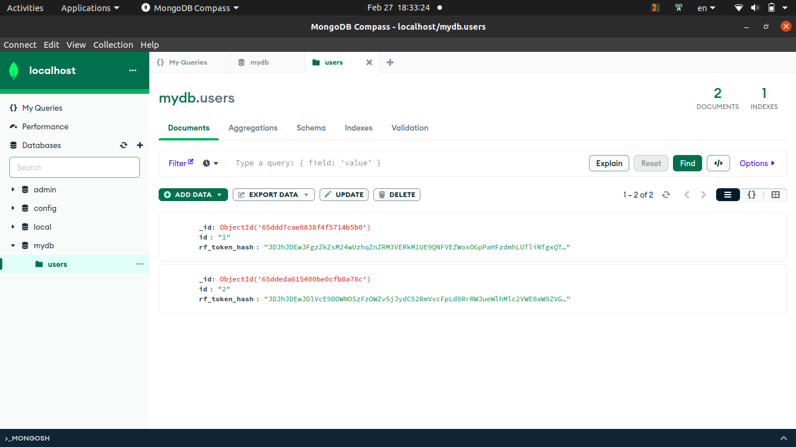

# Проверка маршрутов
## Примечание 
На локальной машине должен быть запущен MongoDB по адресу http://localhost:27017

## Маршрут 1: получение токенов по GUID
В качестве GUID может быть указано произвольное значение: пользователь будет создан и добавлен в БД автоматически, если его прежде не существовало, иначе будут выданы новые токены существующему.

Пример запроса:
```
curl --location 'http://localhost:8080/get_tokens?userID=1'
```
 
Пример ответа:
```json
{
    "access_token": "your_token"
    "refresh_token": "your_token"
}
```

## Маршрут 2: обновление токенов
Принимает 2 параметра: access и refresh токены.

Пример запроса
```
curl --location 'http://localhost:8080/refresh' \
--header 'Content-Type: application/json' \
--data '{
    "access_token": "your_token",
    "refresh_token": "your_token"
}'
```

Ответ аналогичен первому маршруту.

## Проверка требований

[Полное описание ТЗ](https://medods.notion.site/Test-task-BackDev-215fcddafff2425a8ca7e515e21527e7)

### 1. Access токен тип JWT, алгоритм SHA512, хранить в базе строго запрещено.

Функция по генерации соответствующего типа токена:
```go
func GenerateAccessToken(parentHash []byte, userID string) string {
    token := jwt.NewWithClaims(jwt.SigningMethodHS512, &TokenClaims{
        RFTokenHash: parentHash,
        UserID:      userID,
    })

    tokenString, err := token.SignedString([]byte(secretKey))
    if err != nil {
        panic(err)
    }

    return tokenString
}
```

Access токен не хранится в базе данных.

Что касается базы данных: в ней хранится 1 коллекция <b>users</b>, которая содержит документы со структурой <b>id, rf_token_hash</b>:



В реальных проектах пользователи обычно могут аутентифицироваться с нескольких устройств, поэтому хеши потребовалось бы хранить в отдельной коллекции и сопоставлять их с <b>device_id</b>, но в данном случае это не имеет смысла и все хранится в одной коллекции <b>users</b>.

### 2. Refresh токен тип произвольный, формат передачи base64, хранится в базе исключительно в виде bcrypt хеша, должен быть защищен от изменения на стороне клиента и попыток повторного использования.

В качестве Refsresh токена используется случайный набор 32-ух байт. Ниже представлена функция для генерации токена и его хеширования в bcrypt:
```go
func GenerateRFTokenWithHash() ([]byte, []byte) {
    randomBytes := make([]byte, 32)
    if _, err := rand.Read(randomBytes); err != nil {
        panic(err)
    }

    refreshTokenHash, err := bcrypt.GenerateFromPassword(randomBytes, bcrypt.DefaultCost)
    if err != nil {
        panic(err)
    }

    return randomBytes, refreshTokenHash
}
```

Клиент получает Refresh токен в формате base64 без явных преобразований в коде, потому что Gin отправляет ответ с использованием функции IntededJSON, которая под капотом использует encoding/json, а это значит, что наборы байт будут автоматически преобразованы в base64.
```go
// Маршрут 1. Ответ предоставляется в виде JSON.
func GetTokens(c *gin.Context) {
    userID := c.Query("userID")
    c.IndentedJSON(200, GenerateTokens(userID))
}
```

Хеш токена хранится в базе данных в формате base64, но уже с явным преобразованием в коде. Функция для обновления хеша в БД и преобразования его в формат base64:
```go
func UpdateUserRFTokenHash(id string, newHash []byte) {
    coll := client.Database("mydb").Collection("users")

    res := base64.StdEncoding.EncodeToString(newHash)
    update := bson.D{{Key: "$set", Value: bson.D{{Key: "rf_token_hash", Value: res}}}}
    filter := bson.D{{Key: id}}

    _, err := coll.UpdateOne(context.TODO(), filter, update)
    if err != nil {
        panic(err)
    }
}
``` 

Токен защищен от изменений на стороне клиента, потому что хеш актуального токена всегда хранится в БД и сверяется с присланным. По этой же причине клиент не сможет использовать токен повторно: после обновления токенов в базе данных, удаляется старый хеш refresh токена и на его место записывается новый.

### 3. Access, Refresh токены обоюдно связаны, Refresh операцию для Access токена можно выполнить только тем Refresh токеном который был выдан вместе с ним.

Связанность достигается за счет указания bcrypt хеша Refresh токена в полезной нагрузке Access токена. Сервер после проверки подлинности Access токена также проверяет, что хеш из payload сопоставляется с присланным Refresh токеном. 

```go
func RefreshTokens(c *gin.Context) {
    var tokensPair TokensPair
    if err := c.BindJSON(&tokensPair); err != nil {
        c.JSON(401, gin.H{"error": "invalid JSON or token structure"})
        return
    }

    tokenClaims := &TokenClaims{}
    _, err := jwt.ParseWithClaims(tokensPair.AccessToken, tokenClaims, func(token *jwt.Token) (interface{}, error) {
        return []byte(secretKey), nil
    })

    // Алгоритм проверки следующий:
    // 1. Проверка подлинности Access токена
    // 2. Сопоставление хеша из payload с присланным Refresh токеном
    // 3. Проверка наличия данного Refresh токена в БД

    if err != nil {
        c.JSON(401, gin.H{"error": "invalid access token"})
        return
    } else if bcrypt.CompareHashAndPassword(tokenClaims.RFTokenHash, tokensPair.RefreshToken) != nil {
        c.JSON(401, gin.H{"error": "invalid refresh token"})
        return
    } else if !IsHashExistsInDB(tokenClaims.RFTokenHash) {
        c.JSON(401, gin.H{"error": "no such refresh token in db"})
        return
    }

    c.IndentedJSON(200, GenerateTokens(tokenClaims.UserID))
}
```

